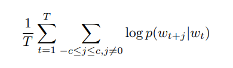
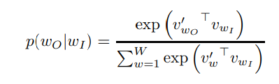

# Word2Vec

## Apresentação

O Word2vec é um grupo de modelos relacionados que são usados para produzir incorporações de palavras. Esses modelos são redes neurais rasas de duas camadas, treinadas para reconstruir contextos linguísticos de palavras. O Word2vec usa como entrada um grande corpus de texto e produz um espaço vetorial, tipicamente com várias centenas de dimensões, com cada palavra exclusiva no corpus sendo atribuída a um vetor correspondente no espaço. Os vetores de palavras são posicionados no espaço vetorial, de modo que as palavras que compartilham contextos comuns no corpus sejam localizadas próximas umas das outras no espaço.

## Modelos

Os dois principais modelos do word2vec são o Skip-Gram e CBOW.

Modelo     | Explicação
---------- | -------------
Skipt-Gram | O modelo fáz um loop nas palavras de cada sentença e usa a atual para saber a localização das vizinhas. 
CBOW       | Usa cada um dos contextos em uma frase para prever a palavra atual. **O limite de palavras em cada contexto é determinada por um parâmetro chamado `window size`.**

O modelo de rede neural skip-gram é um modelo simples de ser implementado. Treine uma rede neural simples com uma única camada oculta para executar uma determinada tarefa, mas não usaremos essa rede neural na tarefa em que a treinamos! Em vez disso, o objetivo é apenas aprender os pesos da camada oculta - veremos que esses pesos são realmente os **vetores de palavras** que estamos tentando aprender.
Vamos treinar a rede neural para fazer o seguinte. Dada uma palavra específica no meio de uma frase, observe as palavras próximas e escolha uma aleatoriamente. A rede nos dirá a probabilidade de cada palavra em nosso vocabulário ser a **palavra próxima** que escolhemos.

As probabilidades de saída estão relacionadas à probabilidade de encontrar cada palavra do vocabulário próxima à nossa palavra de entrada. Por exemplo, se você deu à rede treinada a palavra de entrada `Soviética`, as probabilidades de saída serão muito maiores para palavras como `União` e `Rússia` do que para palavras não relacionadas como `melancia` e `canguru`.

Treinaremos a rede neural para fazer isso, alimentando pares de palavras encontrados em nossos documentos de treinamento. O exemplo abaixo mostra algumas das amostras de treinamento (pares de palavras) que extrairíamos da frase **"A raposa marrom rápida salta sobre o cachorro preguiçoso"**. Eu usei uma janela pequena de 2 apenas para o exemplo. A palavra destacada em azul é a palavra de entrada.

Esse vetor terá 10.000 componentes (um para cada palavra em nosso vocabulário) e colocaremos um "1" na posição correspondente à palavra "formigas" e 0s em todas as outras posições.
A saída da rede é um único vetor (também com 10.000 componentes) contendo, para cada palavra em nosso vocabulário, a probabilidade de uma palavra próxima selecionada aleatoriamente ser essa palavra do vocabulário.
Aqui está a arquitetura da nossa rede neural.

As representações de palavras computadas usando redes neurais são muito interessantes porque os aprendidos
os vetores codificam explicitamente muitas regularidades e padrões linguísticos. Surpreendentemente, muitos dos
esses padrões podem ser representados como traduções lineares. Por exemplo, o resultado de um cálculo vetorial vec ("Madri") - vec ("Espanha") + vec ("França") está mais próximo do vec ("Paris") do que com qualquer outra palavra.

### Modelo de Skip-Gram

De modo formal, o objetivo do treinamento do modelo Skip-gram é encontrar representações de palavras úteis para
prever as palavras ao redor em uma frase ou documento. Mais formalmente, dada uma sequência de
palavras de treinamento w1, w2, w3,. . . , wT, o objetivo do modelo Skip-gram é maximizar a média
probabilidade de log:

onde c é o tamanho do contexto de treinamento (que pode ser uma função da palavra central wt). Maior
c resulta em mais exemplos de treinamento e, portanto, pode levar a uma maior precisão, às custas do tempo de treino. A formulação básica de Skip-gram define p (wt + j | wt) usando a função softmax:

onde vw e v′w são as representações vetoriais de "entrada" e "saída" de w, e W é o número de palavras no vocabulário. Essa formulação é impraticável porque o custo da computação
∇ log p (wO | wI) é proporcional a W, que geralmente é grande (10⁵ ~ 10⁷
Termos).

## Referências

* [stackabuse.com](https://stackabuse.com/implementing-word2vec-with-gensim-library-in-python/)

* [arxiv.org](https://arxiv.org/pdf/1310.4546.pdf)

* [gist.github.com](https://gist.github.com/aparrish/2f562e3737544cf29aaf1af30362f469)

* [dataverse.harvard.edu](https://dataverse.harvard.edu/dataset.xhtml?persistentId=doi:10.7910/DVN/JMFHTN)

* [www.youtube.com](https://www.youtube.com/watch?v=L3D0JEA1Jdc)

* [code.google.com](https://code.google.com/archive/p/word2vec/)

* [en.wikipedia.org](https://en.wikipedia.org/wiki/Word2vec)

* [towardsdatascience.com](https://towardsdatascience.com/word2vec-skip-gram-model-part-1-intuition-78614e4d6e0b)